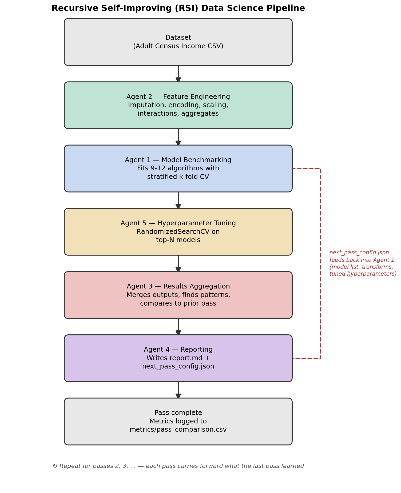

# Recursive Self-Improving (RSI) Data Science Pipeline

A portfolio data science project that predicts income level from census data —
but the real point of the project isn't the prediction. It's the **pipeline
architecture**: five small AI/ML "agents" that hand work to each other, and a
feedback loop that lets the whole system learn from its own results and do
better on the next run, automatically.

This README assumes no prior knowledge of the project. Read it top to bottom
and you should be able to explain, run, and extend the whole thing.

---

## 1. What problem does it actually solve?

The dataset is the **Adult Census Income** dataset: 48,842 people, with
columns like age, education, occupation, hours worked per week, etc. The task
is binary classification — predict whether a person earns **more than
$50K/year** or not.

This is a well-known, unglamorous dataset on purpose. The interesting part of
this project isn't the dataset — it's what wraps around it.

## 2. What is "recursive self-improvement" (RSI), in plain terms?

Most beginner data science projects look like this:

```
load data -> clean data -> train one model -> report accuracy -> done
```

That runs once and stops. This project instead runs in **passes**. Each pass:

1. Engineers features
2. Benchmarks a broad set of models
3. Tunes the best ones
4. Writes a report analyzing what happened
5. Turns that report into instructions for the *next* pass

Pass 2 doesn't start from scratch — it starts from what Pass 1 learned. That's
the "recursive" part: the system's own output becomes its next input. Over
several passes, the pipeline should (in principle) get smarter about itself,
not just about the data.

**Important honesty note:** this doesn't mean the accuracy number goes up
forever. Sometimes a pass tries something (a new feature, a new model) and it
doesn't help — that's a real, useful finding, not a failure of the project.
Section 9 below shows exactly what happened when we ran it for real.

## 3. The five agents

| # | Agent | File | Job |
|---|---|---|---|
| 1 | Model Benchmarking | `agents/agent1_benchmarking.py` | Fits 9–12 different ML algorithms with cross-validation and ranks them |
| 2 | Feature Engineering | `agents/agent2_feature_eng.py` | Cleans and transforms the raw data into better inputs for modeling |
| 3 | Results Aggregation | `agents/agent3_aggregation.py` | Reads Agent 1 & 2's output and writes down *patterns* — not just numbers |
| 4 | Reporting | `agents/agent4_reporting.py` | Turns everything into a human-readable report **and** a machine-readable "what to do next pass" file |
| 5 | Hyperparameter Tuning | `agents/agent5_tuning.py` | Runs a randomized search to fine-tune the best-performing models |

They are called "agents" because each one has one narrow job and hands its
output to the next — like a small assembly line, not one giant script that
does everything.

### The feedback loop (what makes it "recursive")

```
Agent 2 → Agent 1 → Agent 5 → Agent 3 → Agent 4 → (writes next_pass_config.json)
                ↑                                          |
                └──────────────── next pass ────────────────┘
```

Agent 4's `next_pass_config.json` is read by `orchestrator/feedback_loop.py`
at the start of the *next* pass, and it can:
- add new model types to try (e.g. "gradient boosting did well, try its
  histogram-based cousin too")
- add new feature transforms that weren't tried yet
- carry forward the best hyperparameters Agent 5 found, so future passes
  benchmark that model pre-tuned instead of with generic defaults

See the diagram: **`diagrams/pipeline_architecture.png`**



---

## 4. Full file structure

```
rsi-datascience-project/
│
├── README.md                        # This file
├── requirements.txt                 # Python dependencies
├── config.yaml                      # All settings: dataset path, models, transforms, tuning
├── .gitignore                       # Standard Python/Jupyter ignore rules
│
├── data/
│   ├── raw/
│   │   └── adult_income.csv         # The dataset (48,842 rows, 15 columns)
│   ├── processed/                   # (empty — reserved for manual intermediate data if you want it)
│   └── splits/                      # (empty — reserved; this project uses cross-validation, not a fixed split)
│
├── agents/
│   ├── __init__.py                  # Makes this folder an importable Python package
│   ├── agent1_benchmarking.py       # Agent 1: fits and ranks ~9-12 models
│   ├── agent2_feature_eng.py        # Agent 2: cleans/transforms features
│   ├── agent3_aggregation.py        # Agent 3: synthesizes patterns from agents 1, 2, 5
│   └── agent4_reporting.py          # Agent 4: writes report.md + next_pass_config.json
│   └── agent5_tuning.py             # Agent 5: hyperparameter search on top models
│
├── orchestrator/
│   ├── __init__.py
│   ├── data_utils.py                # Shared helpers: load config.yaml, load the CSV
│   ├── feedback_loop.py             # Reads prior pass's next_pass_config.json, merges it in
│   └── pipeline.py                  # THE MAIN ENTRY POINT — runs one full pass end to end
│
├── outputs/
│   └── pass_1/                      # Everything Pass 1 produced (see section 6)
│       ├── engineered_features.csv
│       ├── leaderboard.csv
│       ├── agent1_summary.json
│       ├── agent2_summary.json
│       ├── agent3_summary.json
│       ├── agent5_tuning.json
│       ├── report.md
│       └── next_pass_config.json
│   └── pass_2/, pass_3/, ...        # Created automatically as you run more passes
│
├── metrics/
│   └── pass_comparison.csv          # One row per pass — track whether the score is improving
│
├── diagrams/
│   ├── pipeline_architecture.png    # The visual diagram of the 5-agent loop
│   └── generate_diagram.py          # Script that generated the PNG (re-run if you change the architecture)
│
└── notebooks/
    └── exploration.ipynb            # Optional: look at the raw data by hand before trusting the agents
```

### What's inside each file (quick reference)

| File | Contains |
|---|---|
| `config.yaml` | Dataset path/target column, which models to benchmark, which feature transforms to apply, tuning settings. **This is the file you edit to change what the pipeline does.** |
| `data/raw/adult_income.csv` | Raw census data: age, workclass, education, occupation, hours_per_week, income, etc. |
| `agents/agent1_benchmarking.py` | `MODEL_DEFAULTS` (the list of available models + their default settings), `build_model()`, and `run()` which does the actual cross-validated fitting and writes `leaderboard.csv` |
| `agents/agent2_feature_eng.py` | One function per transform (imputation, encoding, scaling, interactions, aggregates, domain flags) plus `run()` which applies them in a safe order |
| `agents/agent3_aggregation.py` | Rule-based pattern detection (overfitting, instability, scaling effects, tuning results, pass-over-pass comparison) and a list of recommendations |
| `agents/agent4_reporting.py` | Markdown report generator + the logic that decides what the *next* pass's config should look like |
| `agents/agent5_tuning.py` | `PARAM_DISTRIBUTIONS` (search ranges per model) and `run()` which does `RandomizedSearchCV` |
| `orchestrator/pipeline.py` | Calls all five agents in the right order for one pass, then updates `metrics/pass_comparison.csv` |
| `orchestrator/feedback_loop.py` | Loads the previous pass's `next_pass_config.json` (if it exists) and merges it into the current pass's settings |
| `orchestrator/data_utils.py` | Tiny helpers: `load_config()` and `load_raw_data()` |
| `outputs/pass_N/leaderboard.csv` | Every model tried in pass N, sorted by score, with std deviation and overfit gap |
| `outputs/pass_N/report.md` | The full human-readable report for that pass |
| `outputs/pass_N/next_pass_config.json` | The machine-readable instructions carried into pass N+1 |
| `metrics/pass_comparison.csv` | One summary row per pass, so you can see the trend across passes at a glance |

---

## 5. Prerequisites

- Python 3.10 or newer (the code uses modern type hints like `dict | None`)
- pip
- About 200MB of disk space (mostly the engineered features CSV per pass)
- A machine with a few CPU cores helps — Agent 1 and Agent 5 use parallel
  cross-validation and can take a few minutes per pass on a single core

## 6. Step-by-step: how to run this project

**All commands below assume your terminal's current directory is the project
root** (the folder containing `README.md` and `config.yaml`). The code uses
relative paths, so running from anywhere else will fail to find the data
and will write outputs to the wrong place.

### Step 1 — Install dependencies

```bash
cd rsi-datascience-project
pip install -r requirements.txt
```

### Step 2 — (Optional) Look at the raw data first

```bash
jupyter notebook notebooks/exploration.ipynb
```

This just loads the CSV and shows you shape, dtypes, missing values, and
class balance. Skip this if you just want to run the pipeline.

### Step 3 — Run Pass 1

```bash
python orchestrator/pipeline.py --pass 1
```

This runs Agent 2 → Agent 1 → Agent 5 → Agent 3 → Agent 4 in sequence and
prints progress as it goes. Expect this to take **several minutes** — Agent 1
is fitting up to 11 models with 5-fold cross-validation, and Agent 5 is
running a randomized hyperparameter search on top of that.

When it finishes, check:
```bash
cat outputs/pass_1/report.md
```

### Step 4 — Run Pass 2

```bash
python orchestrator/pipeline.py --pass 2
```

This is where the "recursive" part becomes visible. Watch the console output
— you'll see a `[feedback_loop]` message listing what was carried forward
from Pass 1 (e.g. new model families to try, new feature transforms, tuned
hyperparameters).

### Step 5 — Run Pass 3 (and beyond)

```bash
python orchestrator/pipeline.py --pass 3
```

Repeat as many times as you like — each pass builds on the last one's
`next_pass_config.json`.

### Step 6 — Compare passes

```bash
cat metrics/pass_comparison.csv
```

This one file gives you the whole story at a glance: best model per pass,
best score, feature count, and whether tuning found any improvements.

### Resetting and starting over

If you want a completely clean run:

```bash
rm -rf outputs metrics/pass_comparison.csv
mkdir outputs
python orchestrator/pipeline.py --pass 1
```

This does **not** touch `config.yaml` or `data/raw/adult_income.csv`, so
your base settings and dataset are untouched.

---

## 7. Understanding `config.yaml`

This is the one file you're most likely to want to edit:

```yaml
dataset:
  path: data/raw/adult_income.csv   # swap in your own dataset here
  target: income                     # the column you're predicting
  positive_class: ">50K"             # which value of the target counts as "positive"

pass_number: 1                       # base pass number (usually leave at 1)

agent1_benchmarking:
  model_families: [...]              # which models Agent 1 tries first
  cv_folds: 5                        # number of cross-validation folds
  scoring: roc_auc                   # metric used to rank models
  tuned_params: {}                   # auto-filled by the feedback loop; leave empty initially

agent2_feature_engineering:
  transforms: [...]                  # which feature transforms Agent 2 applies first

agent5_tuning:
  n_top_models: 3                    # how many top models Agent 5 tunes each pass
  n_iter: 8                          # how many random hyperparameter combinations to try per model
  cv_folds: 3                        # cross-validation folds used during tuning (kept lower than Agent 1's for speed)
```

You generally do **not** need to edit `tuned_params` by hand — it gets
populated automatically as passes run.

---

## 8. What "done" looks like after a pass

After `python orchestrator/pipeline.py --pass 1` finishes, `outputs/pass_1/`
will contain:

- **`engineered_features.csv`** — the dataset after Agent 2's transforms
- **`leaderboard.csv`** — every model, ranked, with score/std/overfit gap
- **`agent1_summary.json`** — Agent 1's structured findings (top models,
  unstable models, overfitting models)
- **`agent2_summary.json`** — what transforms were applied and the resulting
  shape change
- **`agent5_tuning.json`** — tuning results per model (baseline vs. tuned
  score, winning hyperparameters)
- **`agent3_summary.json`** — the synthesized patterns and recommendations
- **`report.md`** — the full human-readable report (open this first)
- **`next_pass_config.json`** — what the next pass will actually use

---

## 9. Real results from a verified 3-pass run

This isn't a mocked-up example — this is what actually happened when Passes
1, 2, and 3 were run end to end on this exact codebase.

**Dataset:** 48,842 rows → Agent 2 expanded 14 raw columns to 33-36
engineered features depending on which transforms were active that pass.

### Pass-over-pass summary

| Pass | Best model | Score (ROC-AUC) | Features | Overfitting models | Models tuned | Tuning improvements |
|---|---|---|---|---|---|---|
| 1 | lightgbm | 0.9296 | 33 | 3 | 3 | 2 |
| 2 | xgboost | 0.9288 | 36 | 3 | 2 | 0 |
| 3 | xgboost | 0.9288 | 36 | 3 | 2 | 0 |

### Pass 1 — establishing the baseline

Agent 1 benchmarked 11 models. `lightgbm` led at 0.9296. Agent 5 tuned the
top 3 (`lightgbm`, `xgboost`, `gradient_boosting`) and found real
improvements for two of them:

| Model | Baseline | Tuned | Result |
|---|---|---|---|
| lightgbm | 0.9296 | 0.9284 | did **not** beat baseline |
| xgboost | 0.9249 | 0.9286 | **improved** by +0.0037 |
| gradient_boosting | 0.9222 | 0.9270 | **improved** by +0.0049 |

Agent 3 also caught that `random_forest`, `extra_trees`, and `decision_tree`
were overfitting, and that scaling helped scale-sensitive models (logistic
regression, KNN) without affecting tree-based ones — both found automatically
from the numbers, not hardcoded.

Agent 4 carried forward into Pass 2: a new model family
(`hist_gradient_boosting`, since `gradient_boosting` did well and Agent 4
knows its faster cousin is worth testing), two new feature transforms
(`interaction_terms`, `aggregated_features`) that hadn't been tried yet, and
the tuned hyperparameters for `xgboost` and `gradient_boosting`.

### Pass 2 — the feedback loop pays off, then a new plateau appears

With the new transforms and `hist_gradient_boosting` added, and `xgboost` /
`gradient_boosting` now benchmarked pre-tuned instead of with defaults,
**`xgboost` (tuned) became the new best model at 0.9288** — a direct result
of carrying Pass 1's tuning forward.

Agent 5 then tried tuning the *newly discovered* top performers,
`hist_gradient_boosting` and `lightgbm` (skipping `xgboost` and
`gradient_boosting` since they were already tuned) — but neither improved on
their own baselines this time:

| Model | Baseline | Tuned | Result |
|---|---|---|---|
| hist_gradient_boosting | 0.9285 | 0.9280 | did not beat baseline |
| lightgbm | 0.9284 | 0.9276 | did not beat baseline |

Since nothing new got carried forward this time (the only recommendation was
"add regularization," which isn't yet a concrete action — see Section 10),
Pass 3's config ended up identical to Pass 2's.

### Pass 3 — a genuine, honest plateau

With an unchanged config, unchanged features, and fixed random seeds
throughout the codebase, Pass 3 produced **exactly the same leaderboard and
the same tuning outcome as Pass 2.** This is not a bug — it's the real
outcome of a deterministic system given the same inputs, and it exposes
precisely where this version of the recursion runs out of new ideas to try.
That's a genuinely useful, honest finding for a portfolio write-up: the
system correctly recognized it had nothing new to explore, rather than
pretending to improve.

---

## 10. Known limitations (be upfront about these)

Being honest about what a project *doesn't* do yet is a stronger signal of
understanding than pretending everything is perfect. This is exactly what
the verified 3-pass run above demonstrated:

1. **The best score doesn't always go up between passes.** Pass 1's untuned
   `lightgbm` (0.9296) actually beat Pass 2 and 3's tuned `xgboost` (0.9288)
   on raw score. Adding new features and models moved the *ranking* of best
   model but not the ceiling — a real result, not a bug. If this happens to
   you on your own dataset, report it rather than hiding it.
2. **The pipeline plateaued at Pass 3, and this is traceable to a specific
   cause.** Agent 3's recommendation "add regularization for overfitting
   models" isn't tied to any concrete action anywhere in the codebase —
   Agent 1 doesn't automatically apply it, and Agent 5 doesn't tune away
   overfitting specifically. Once Agent 5 had already tuned the reachable
   top models and no new transforms or model families were left to add, the
   config stopped changing between passes, and — since every part of the
   pipeline uses fixed random seeds — an unchanged config means an
   identical, fully deterministic result. This isn't unpredictable
   behavior; it's the system correctly running out of new ideas within its
   current action space.
   A natural extension: have Agent 1 automatically cap depth or add
   regularization parameters for any model flagged as overfitting, so that
   recommendation becomes a real action instead of a description.

## 11. Ideas for extending this project

- Add a 6th agent that does automatic feature selection (drop
  low-importance features flagged by Agent 3)
- Have Agent 1 automatically cap model complexity for anything Agent 3 flags
  as overfitting, instead of just recommending it in the report
- Swap in your own dataset by changing `config.yaml`'s `dataset` section —
  the whole pipeline is dataset-agnostic as long as it's tabular
  classification with a binary target
- Add SHAP-based feature importance to Agent 3's pattern detection

## 12. Troubleshooting

- **"No such file or directory: data/raw/..."** — you're not running the
  command from the project root. `cd` into the folder containing this
  README first.
- **A pass takes a long time / seems to hang** — Agent 1 fits up to 11
  models with 5-fold CV, and Agent 5 runs a hyperparameter search on top of
  that. This is genuinely CPU-intensive; on a slow or single-core machine,
  a full pass can take several minutes. Let it run — don't interrupt
  partway through, since agents write their JSON/CSV output only after they
  finish.
- **`ModuleNotFoundError` when running an agent file directly** — always run
  agent files via `python agents/agent1_benchmarking.py` (or through
  `orchestrator/pipeline.py`) from the project root, not from inside the
  `agents/` folder.
- **Want to change the dataset?** Edit `dataset.path`, `dataset.target`, and
  `dataset.positive_class` in `config.yaml`. Agent 2's domain-specific
  transforms (`interaction_terms`, `aggregated_features`,
  `domain_specific_transformations`) reference this dataset's specific
  column names (`age`, `education_num`, `capital_gain`, etc.) — you'll want
  to adjust those functions in `agents/agent2_feature_eng.py` for a
  different dataset.
